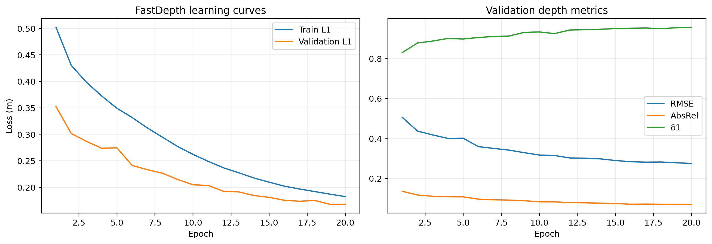
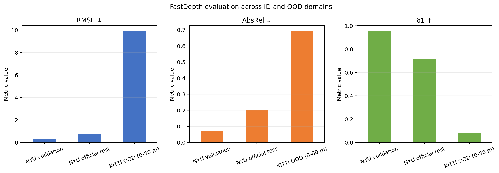
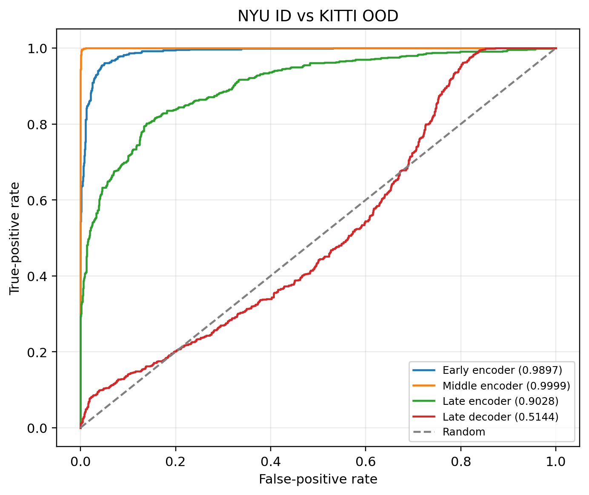
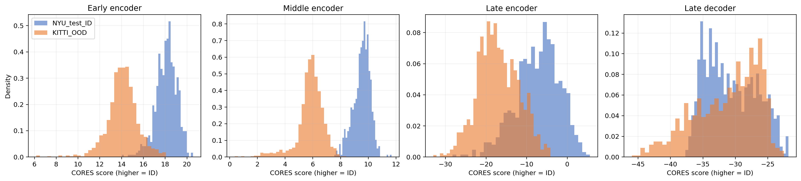
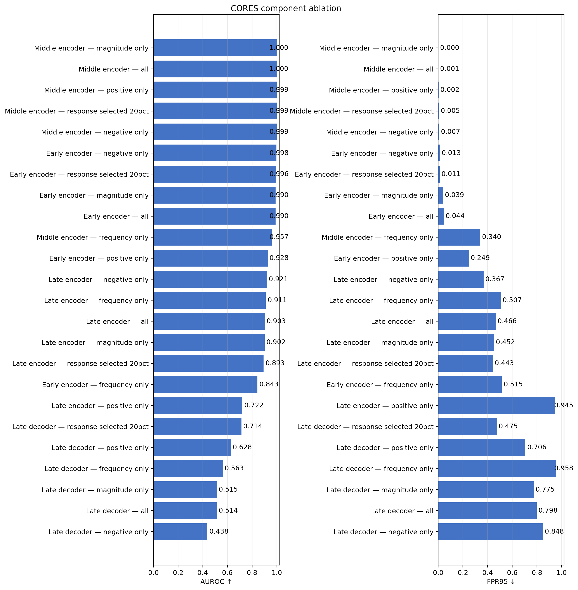
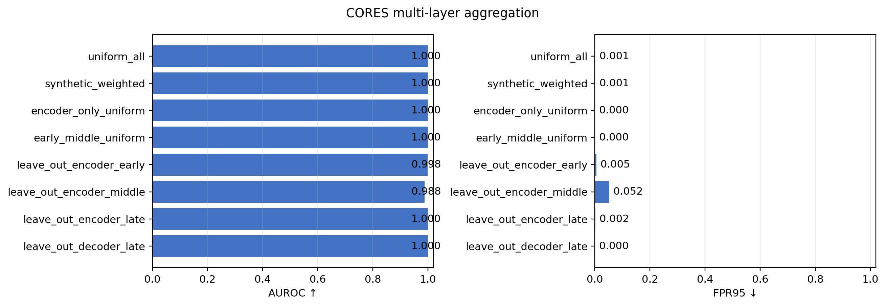
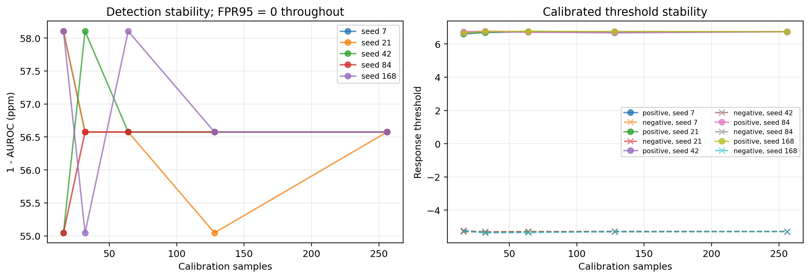
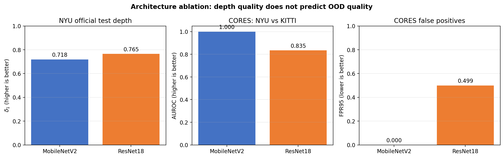

# CORES for Monocular Depth Estimation

**Computer Vision — Fall/Winter 2026** 
**Students:** _insert names and student IDs before submission_ 
**Repository:** <https://github.com/Plomo-02/Project2_CV>

## Abstract

This project studies whether convolutional responses from a monocular depth
estimation network can identify out-of-distribution inputs. A lightweight
FastDepth-style model is trained on NYU Depth v2 and evaluated for depth
prediction on its official test split. CORES is then adapted from image
classification to dense depth estimation and evaluated with NYU as the
in-distribution domain and KITTI as the out-of-distribution domain. The study
includes layer-wise and component ablations, RGB-statistics and training-state
controls, synthetic corruptions, leakage-free threshold calibration,
multi-layer aggregation, calibration stability, and an independently trained
ResNet18 architectural ablation.

## 1. Introduction

Monocular depth estimators can produce plausible predictions even when their
inputs differ substantially from the training distribution. Detecting such
inputs is therefore important for interpreting model reliability. This work
investigates whether CORES, an OOD score based on signed convolutional
responses, remains useful when the underlying task is dense regression rather
than classification.

The main research questions are:

1. Can CORES distinguish NYU indoor images from KITTI outdoor images?
2. Which encoder or decoder stage contains the strongest OOD signal?
3. Which CORES components are responsible for the separation?
4. Does multi-layer aggregation improve over the best individual layer?
5. How stable are the conclusions across calibration protocols, seeds, and
   calibration-set sizes?
6. Does the same CORES behaviour transfer to a different convolutional encoder?

## 2. Related work

### 2.1 Monocular depth estimation and FastDepth

Monocular depth estimation predicts a dense metric depth map from one RGB image.
Unlike active RGB-D or LiDAR sensing, it requires no dedicated ranging hardware,
but a single image leaves scale and geometry ambiguous. FastDepth addresses the
additional constraint of embedded inference with a lightweight encoder-decoder
and an efficient depthwise-separable decoder [2]. Its original implementation
uses MobileNetV1; this project retains the FastDepth decoder principles—nearest
upsampling, additive skip connections, and depthwise 5 × 5 convolutions—but uses
a maintained torchvision MobileNetV2 encoder.

MobileNetV2 builds efficient features through inverted residual blocks and
linear bottlenecks [3]. It is a suitable maintained backbone because it exposes
multiple convolutional stages while keeping the complete depth model at 2.39
million parameters. This implementation is therefore described as
*FastDepth-style*, not as an exact reproduction of the original ICRA model.

### 2.2 Out-of-distribution detection and CORES

Post-hoc OOD detectors attempt to identify inputs that differ from a model's
training distribution without retraining the task model. CORES starts from the
observation that convolutional kernels generally produce more pronounced
responses for ID inputs [1]. For each kernel it analyses the maximum and minimum
spatial responses, measuring both how far they exceed calibrated positive or
negative thresholds and how frequently such threshold crossings occur.

The original method backtracks from prominent classifier predictions to select
sample-relevant kernels across layers [1]. A monocular depth network has dense
regression outputs rather than class logits, so that exact class-kernel
trajectory is unavailable. Our primary adaptation evaluates all kernels at
named encoder and decoder stages. A second variant selects the 20% channels with
the most extreme positive and negative responses per sample. Both variants are
reported explicitly so that results from the dense-prediction adaptation are
not misrepresented as a direct reproduction of the classification method.

## 3. Method

### 3.1 Depth-estimation baseline

The baseline uses a MobileNetV2 encoder with a lightweight decoder and produces
one dense depth channel. RGB inputs are resized to 224 × 304. Invalid depth
pixels are excluded from the masked L1 training loss and from every evaluation
metric. The model contains 2,390,713 parameters and is trained on the official
NYU training split using a deterministic train/validation partition.

| Setting | Value |
|---|---:|
| Input resolution | 224 × 304 |
| Batch size | 8 |
| Optimizer | AdamW |
| Initial learning rate | 1 × 10⁻⁴ |
| Weight decay | 1 × 10⁻⁴ |
| Maximum epochs | 20 |
| Validation fraction | 0.10 |
| NYU valid range | 0–10 m |
| KITTI evaluation range | 0–80 m |

Training uses masked metric L1 loss, automatic mixed precision, a
ReduceLROnPlateau scheduler, validation-based best-checkpoint selection, and
recovery checkpoints every 250 batches. The final experiment ran on a Kaggle
Tesla T4 using PyTorch.

### 3.2 CORES adaptation to dense prediction

Signed pre-activation responses are captured at four locations: early, middle,
and late encoder stages and a late decoder stage. Since a depth estimator has
no class-specific output kernel, the baseline aggregates all convolutional
channels. This is an explicit adaptation of CORES rather than a claim of an
identical classification implementation.

For each layer, thresholds are calibrated using NYU validation responses only.
The score combines positive and negative response magnitudes and frequencies;
higher values indicate stronger agreement with the ID response pattern.

For a response tensor $A \in \mathbb{R}^{C \times H \times W}$, let
$p_c=\max_{h,w}A_{c,h,w}$ and $n_c=\min_{h,w}A_{c,h,w}$. With calibrated
thresholds $\tau^+$ and $\tau^-$, the four components are

$$
RM^+=\frac{1}{C}\sum_c[p_c-\tau^+]_+,\quad
RM^-=\frac{1}{C}\sum_c[\tau^- - n_c]_+,
$$

$$
RF^+=\frac{1}{C}\sum_c\mathbf{1}(p_c>\tau^+),\quad
RF^-=\frac{1}{C}\sum_c\mathbf{1}(n_c<\tau^-).
$$

We compute the ranking-equivalent log score

$$
S=10\left(\log RM^+ + \log RM^-\right)
 + \log RF^+ + \log RF^-,
$$

using an epsilon of $10^{-12}$ for numerical stability. The magnitude-only
ablation removes the two frequency terms.

### 3.3 Multi-layer aggregation

Layer scores are centered and scaled using NYU validation statistics. Uniform,
encoder-only, early-middle, leave-one-layer-out, and synthetic-noise-weighted
aggregations are compared. Synthetic weights are estimated from clean NYU
validation samples and Gaussian/uniform noise only. KITTI is never used to
choose thresholds, normalization statistics, weights, or configurations.

## 4. Experimental protocol

### 4.1 Datasets and splits

- NYU Depth v2 official training split: depth training and internal validation.
- NYU Depth v2 official test split: final ID evaluation.
- KITTI depth-prediction evaluation split: final OOD evaluation.

The deterministic split contains 42,826 training, 4,758 validation, and 654 NYU
test samples. KITTI contributes 1,000 OOD samples.

NYU Depth v2 contains indoor RGB-D scenes captured with a Microsoft Kinect [4].
KITTI contains outdoor driving data recorded from a vehicle-mounted multi-sensor
platform [5]; its depth-prediction benchmark provides aligned RGB images and
LiDAR-derived depth maps [6]. RGB inputs from both domains use the same resize
and ImageNet normalization. Depth targets remain in metres and are resized with
a separately propagated validity mask.

### 4.2 Metrics

Depth quality is measured with L1, RMSE, AbsRel, and δ accuracy thresholds.
OOD ranking is measured with AUROC and FPR95, where lower FPR95 is better.
Selected comparisons include stratified percentile bootstrap confidence
intervals.

### 4.3 Controls and ablations

The experimental controls cover CORES components, response-selected channels,
an RGB Mahalanobis baseline, trained/ImageNet/random model states, synthetic
near-OOD corruptions, synthetic-noise threshold calibration, and calibration
subsampling across five random seeds.

## 5. Results

### 5.1 Depth-estimation baseline

The best validation checkpoint was obtained at epoch 19.

| Split | L1 | RMSE | AbsRel | δ1 | δ2 | δ3 |
|---|---:|---:|---:|---:|---:|---:|
| NYU validation | 0.1676 | 0.2778 | 0.0701 | 0.9530 | 0.9897 | 0.9971 |
| NYU official test | 0.5071 | 0.7901 | 0.2016 | 0.7181 | 0.9171 | 0.9698 |
| KITTI OOD (0–80 m) | 6.3899 | 9.8854 | 0.6912 | 0.0792 | 0.1655 | 0.2725 |

The larger official-test error relative to the internal validation split is
reported rather than hidden: the two splits come from different packaged
sampling procedures, and the result limits claims about absolute depth quality.
On KITTI, the NYU-trained model deteriorates sharply. Its output is capped at
the 10 m NYU training range while KITTI is evaluated up to 80 m; therefore these
numbers measure cross-domain failure, not a competitive KITTI benchmark. This
is nevertheless the evaluation required here: CORES identifies as OOD a domain
on which metric depth quality genuinely collapses.

### 5.2 Layer-wise OOD detection

| Layer | AUROC | FPR95 |
|---|---:|---:|
| Early encoder | 0.9897 | 0.044 |
| Middle encoder | **0.9999** | **0.001** |
| Late encoder | 0.9028 | 0.466 |
| Late decoder | 0.5144 | 0.798 |
| Uniform multi-layer mean | 0.9997 | **0.001** |

The middle encoder is the strongest individual feature stage. The decoder is
close to random, suggesting that depth reconstruction substantially changes or
discards the domain evidence available in intermediate encoder responses.

### 5.3 Ablations and controls

Magnitude-only middle-layer CORES reaches AUROC 0.99994 and FPR95 0.000. The RGB
baseline reaches only AUROC 0.82283 and FPR95 0.759. Performance decreases to
AUROC 0.91886 without depth training and to 0.45062 with a fully random encoder.
These controls show that the separation cannot be explained solely by simple
RGB statistics or arbitrary convolutional features.

Synthetic Gaussian/uniform threshold calibration reaches AUROC 0.99868 and
FPR95 0.007 without using KITTI for model selection. This small reduction
supports the robustness of the main conclusion to the threshold protocol.

### 5.4 Multi-layer aggregation and stability

| Aggregation | AUROC | FPR95 |
|---|---:|---:|
| All layers, uniform | 0.999737 | 0.001 |
| Synthetic-noise weighted | 0.999737 | 0.001 |
| Encoder only, uniform | **0.999884** | **0.000** |
| Early + middle encoder | 0.999881 | **0.000** |
| Leave out early encoder | 0.998469 | 0.005 |
| Leave out middle encoder | 0.987777 | 0.052 |
| Leave out late encoder | 0.999569 | 0.002 |
| Leave out late decoder | **0.999884** | **0.000** |

The synthetic-noise criterion produces equal weights because every layer
perfectly separates clean validation images from Gaussian and uniform noise.
It is therefore a saturated calibration proxy, not evidence that every layer
is equally useful on real OOD data. Excluding the decoder improves the uniform
mean, and excluding the middle encoder causes the largest degradation. The best
single detector remains middle-encoder magnitude-only CORES (AUROC 0.999943,
FPR95 0.000), which is also simpler than multi-layer inference.

| Calibration samples | Mean AUROC | AUROC std | Maximum FPR95 |
|---:|---:|---:|---:|
| 16 | 0.999943 | 0.00000167 | 0.000 |
| 32 | 0.999943 | 0.00000108 | 0.000 |
| 64 | 0.999943 | 0.00000068 | 0.000 |
| 128 | 0.999944 | 0.00000068 | 0.000 |
| 256 | 0.999943 | 0.00000000 | 0.000 |

Across five seeds per calibration size, FPR95 remains zero in all 25 trials.
The detector is therefore insensitive to calibration seed and sample count for
this broad cross-dataset shift, including when only 16 ID samples are used.

### 5.5 Architectural ablation: ResNet18

To test whether the result is architecture-independent, we trained a second
depth network with a pretrained ResNet18 encoder and the same decoder design,
data splits, resolution, loss, optimizer family, epoch budget, evaluation
metrics, and CORES protocol. It has 11,383,457 parameters, compared with
2,390,713 for the MobileNetV2 model.

| Model | NYU test RMSE | NYU test AbsRel | NYU test δ1 | KITTI RMSE | Middle magnitude AUROC | FPR95 |
|---|---:|---:|---:|---:|---:|---:|
| MobileNetV2 | **0.7901** | **0.2016** | 0.7181 | 9.8854 | **0.999943** | **0.000** |
| ResNet18 | 1.0801 | 0.2093 | **0.7652** | **9.5713** | 0.834523 | 0.499 |

ResNet18 improves NYU-test δ1 and all three reported KITTI metrics, although it
is worse on NYU-test L1, RMSE, and AbsRel. Its best single CORES component is
middle positive-only (AUROC 0.877557, FPR95 0.459), while the directly matched
middle magnitude score reaches only 0.834523/0.499. Neither multi-layer
aggregation nor calibration resampling closes this gap.

The training-state control also reverses: ResNet18 middle-magnitude AUROC drops
from 0.916150 with ImageNet-only weights to 0.834523 after depth training. For
MobileNetV2 it rises from 0.918858 to 0.999943. Thus stronger depth accuracy
does not imply stronger CORES detection, and task training can affect response
separation in an architecture-dependent direction.

## 6. Discussion

The very large NYU/KITTI separation is both a strength and a limitation. It
demonstrates that intermediate depth-network responses contain a strong domain
signal, but NYU indoor scenes and KITTI road scenes represent a broad domain
shift. Synthetic corruptions provide a more difficult complementary test:
Gaussian noise yields AUROC 0.94273 but FPR95 0.388, showing that near-OOD
detection is not solved by the almost perfect cross-dataset result.

Remaining limitations include one trained checkpoint per architecture, the
absence of semantic class kernels in dense regression, and synthetic rather
than naturally occurring near-OOD datasets. The two encoders also differ in
capacity, so the ablation establishes architectural dependence but does not
isolate parameter count as its cause.

## 7. Conclusion

Intermediate convolutional responses from a depth estimator provide a very
strong signal for distinguishing NYU from KITTI. The most effective and
efficient configuration is the magnitude component from the middle encoder,
which reaches AUROC 0.999943 and FPR95 0.000. Multi-layer aggregation does not
improve this result, primarily because weaker late and decoder responses dilute
the useful middle-layer signal. Controls against RGB statistics, pretraining,
random features, threshold protocols, calibration seeds, and calibration sizes
support the robustness of the MobileNetV2 result. The ResNet18 ablation shows
that this near-perfect performance is not universal: depth quality and CORES
quality can move independently, and depth training can either strengthen or
weaken domain separation. Performance on Gaussian near-OOD corruption and the
large indoor/outdoor gap leave near-distribution detection as the key open
direction.

## References

1. K. Tang, C. Hou, W. Peng, R. Chen, P. Zhu, W. Wang, and Z. Tian,
   “[CORES: Convolutional Response-based Score for Out-of-distribution
   Detection](https://openaccess.thecvf.com/content/CVPR2024/html/Tang_CORES_Convolutional_Response-based_Score_for_Out-of-distribution_Detection_CVPR_2024_paper.html),”
   *CVPR*, pp. 10916–10925, 2024.
2. D. Wofk, F. Ma, T.-J. Yang, S. Karaman, and V. Sze,
   “[FastDepth: Fast Monocular Depth Estimation on Embedded
   Systems](https://fastdepth.mit.edu/2019_icra_fastdepth.pdf),” *ICRA*,
   pp. 6101–6108, 2019.
3. M. Sandler, A. Howard, M. Zhu, A. Zhmoginov, and L.-C. Chen,
   “[MobileNetV2: Inverted Residuals and Linear
   Bottlenecks](https://openaccess.thecvf.com/content_cvpr_2018/html/Sandler_MobileNetV2_Inverted_Residuals_CVPR_2018_paper.html),”
   *CVPR*, pp. 4510–4520, 2018.
4. N. Silberman, P. Kohli, D. Hoiem, and R. Fergus,
   “[Indoor Segmentation and Support Inference from RGBD
   Images](https://cs.nyu.edu/~fergus/datasets/nyu_depth_v2.html),” *ECCV*,
   2012.
5. A. Geiger, P. Lenz, and R. Urtasun,
   “[Are We Ready for Autonomous Driving? The KITTI Vision Benchmark
   Suite](https://www.cvlibs.net/projects/autonomous_vision_survey/literature/Geiger2012CVPR.pdf),”
   *CVPR*, 2012.
6. KITTI Vision Benchmark Suite,
   “[Depth Prediction Evaluation](https://www.cvlibs.net/datasets/kitti/eval_depth_all.php),”
   accessed August 2026.
7. L. Papa, P. Russo, and I. Amerini,
   “[METER: A Mobile Vision Transformer Architecture for Monocular Depth
   Estimation](https://doi.org/10.1109/TCSVT.2023.3260310),” *IEEE Transactions
   on Circuits and Systems for Video Technology*, vol. 33, no. 10,
   pp. 5882–5893, 2023.
